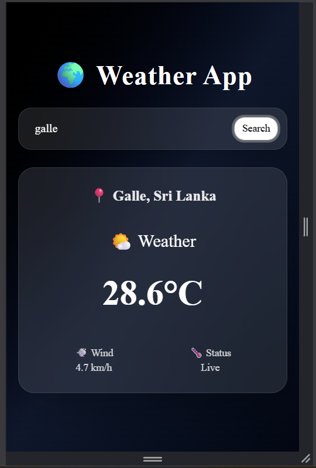

# 🌍 Weather App

A modern weather application built with **Next.js** that allows users to search any city and view real-time weather conditions using the Open-Meteo API.  
The project features a dark-themed UI built with ShadCN components and Tailwind CSS.

---

## 🚀 Features

- 🔍 Search weather by city name
- 🌡️ Real-time temperature display
- 💨 Wind speed information
- ❄️ Snow / Rain / Fog / Clear condition detection
- 🌙 Dark modern UI design
- ⚡ Fast API integration with Next.js API routes

---

## 📸 Screenshots

### 🌤️ Weather Result


---

## 🛠️ Tech Stack

- Next.js (App Router)
- React Hooks
- Tailwind CSS
- ShadCN UI
- Open-Meteo API

---

## 📦 Installation

```bash
git clone https://github.com/your-username/weather-app
cd weather-app
npm install
npm run dev